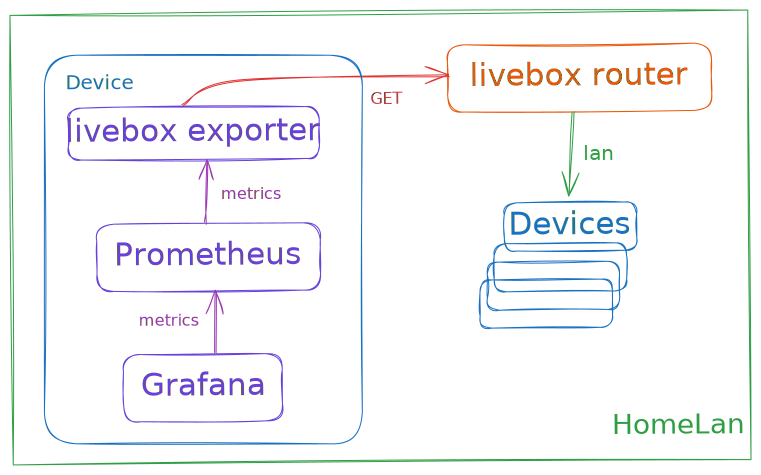

# livebox-exporter-rs

<p>
    <a href="https://github.com/tchapacan/livebox-exporter-rs">
        
    </a>
    <a href="https://github.com/tchapacan/livebox-exporter-rs/blob/main/LICENSE">
        
    </a>
    <a href="https://github.com/tchapacan/livebox-exporter-rs/actions?query=workflow%3A%22Code%20Checks%22">
        
    </a>
    <a href="https://api.securityscorecards.dev/projects/github.com/tchapacan/livebox-exporter-rs">
      
    </a>
</p>

A basic livebox exporter written in [rust](https://doc.rust-lang.org/book/title-page.html) 🦀. Start monitoring your livebox router's using [Prometheus](https://github.com/prometheus/prometheus) / [Grafana](https://github.com/grafana/grafana) 💪.

> ℹ️ **Note:** this minimal, draft, poc, "tool" **almost work with some luck** as it is now 🤞, but for "cool" educational purpose only. Some alternatives already **[exists](#alternative)** (check below), but didn't find any **rust** version yet. As I always wanted to learn **rust**, and I have a **livebox router** next to me, let's fill the gap (I think lol)! **Contributions/help/suggestions are really welcome!**


## Features

Available:

- **Should work** on livebox 4 and upper 🤷🏻‍
- **Extracts metrics:** general status, wan configuration, devices status, bandwidth
- **Exposes metrics:** in Prometheus format, compatible with Grafana

Future:

- *Docker image soon available...*
- *Grafana dashboard template soon available...*
- *More metrics...*


## Metrics

| **Metric Name**                   | **Description**                         | **Type**  |
|-------------------------------|-------------------------------------|-------|
| livebox_infos_status         | Livebox general status              | gauge |
| livebox_infos_uptime         | Livebox uptime                      | gauge |
| livebox_infos_reboot         | Livebox count of reboots            | gauge |
| livebox_wan_status           | Livebox wan status                  | gauge |
| livebox_link_status          | Livebox link status                 | gauge |
| livebox_interface_bytes_rx  | Livebox interface bytes received    | gauge |
| livebox_interface_bytes_tx  | Livebox interface bytes transmitted | gauge |
| livebox_device_status        | Livebox connected devices status    | gauge |


## Usage

To use **livebox-exporter-rs**, follow these steps:

1. **Clone the Repository:** to your local machine.

   ```bash
   git clone https://github.com/tchapacan/livebox-exporter-rs.git
   ```

2. **Build the Project:** go to the project directory and build the project.

    ```bash
    cd livebox-exporter-rs
    cargo build --release
    ```

3. **Run the Exporter:** run the binary, using the options.

    ```bash
    livebox-exporter-rs -P <livebox_password> -p <exporter_port>
    ```

4. **Access Metrics:** Once the exporter is running, access the exposed metrics at:

   `http://localhost:<exporter_port>/metrics`


## Options

Supported command-line options (hope `-P` vs `-p` not to confusing):

| Option                 | Description                                   | Default Value |
|------------------------|-----------------------------------------------|---------------|
| -P, --password <password> | Livebox password **(required)**                 | None          |
| -p, --port <port>         | Exporter port                                 | 9100          |
| -l, --listen <address>    | Listen address                                | 0.0.0.0       |
| -v, --verbose             | Enable verbose logging (repeat for increased verbosity) | Off     |
| -h, --help                | Display help message                         | N/A           |

```bash
Usage: livebox-exporter-rs [OPTIONS] --password <password>

Options:
  -p, --port <port>          exporter port [default: 9100]
  -l, --listen <address>     listen address [default: 0.0.0.0]
  -v, --verbose...           verbose logging
  -P, --password <password>  Livebox password [required]
  -h, --help                 Print help
  -V, --version              Print version
```

## Details



- Use the [prometheus_exporter_base](https://github.com/MindFlavor/prometheus_exporter_base) crate for formatting Prometheus metrics.
- Based on a rework version of the [livebox](https://crates.io/crates/livebox/) rust client project to output additional metrics.

## Contributing

Contributions are really welcome! If you encounter any issues, have suggestions, or would like to add/fix features, please do:

- Open an issue to report bugs or request features.
- Fork the repository, create your branch, make your changes, and submit a pull request.

For more details here are the [contribution guidelines](CONTRIBUTING.md)


## Alternatives

- https://github.com/Tomy2e/livebox-exporter
- https://github.com/jeanfabrice/livebox-exporter
- https://la.robinjiang.com/cyr-ius/hass-livebox-component
- https://la.robinjiang.com/p-dor/LiveboxMonitor
- and surely even more...


## Legal

`Livebox` is a trademark owned by France Telecom and Orange, and is their property. This tool only uses the name as it is the router this exporter is about. No intellectual property infrigement intended. This work has been done for educational purpose as a personal monitoring side project and shared to the community. If there's any issue with the use of this name here, please don't hesitate to contact me.
