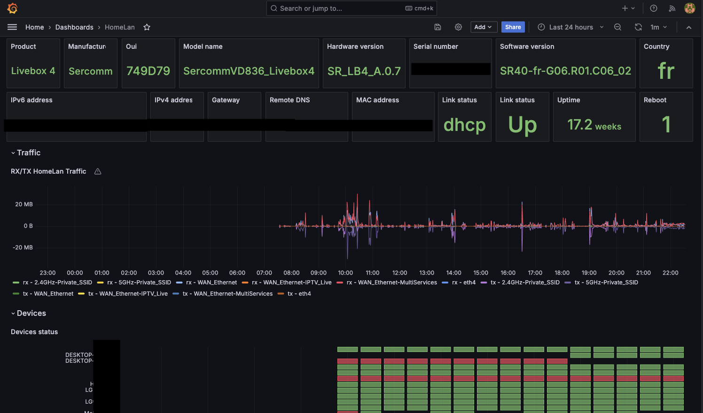

# livebox-exporter-rs

<p>
    <a href="https://github.com/tchapacan/livebox-exporter-rs">
        
    </a>
    <a href="https://github.com/tchapacan/livebox-exporter-rs/blob/main/LICENSE">
        
    </a>
    <a href="https://github.com/tchapacan/livebox-exporter-rs/actions?query=workflow%3A%22Code%20Checks%22">
        
    </a>
    <a href="https://api.securityscorecards.dev/projects/github.com/tchapacan/livebox-exporter-rs">
      
    </a>
</p>

A basic livebox exporter written in [rust](https://doc.rust-lang.org/book/title-page.html) 🦀. Start monitoring your livebox router's using [Prometheus](https://github.com/prometheus/prometheus) / [Grafana](https://github.com/grafana/grafana) 💪.


## Features

- **Should work** on livebox 4 and upper 🤷🏻‍
- **Extracts metrics:** general status, wan configuration, devices status, bandwidth
- **Exposes metrics:** in Prometheus format, compatible with Grafana
- **Docker image:** [tchapacan/livebox-exporter-rs:latest](https://hub.docker.com/r/tchapacan/livebox-exporter-rs)
- **Grafana dashboard template:** check the `example` folder



## Metrics

| **Metric Name**              | **Description**                     | **Type**  |
|------------------------------|-------------------------------------|-----------|
| livebox_infos_status         | Livebox general status              | gauge     |
| livebox_infos_uptime         | Livebox uptime                      | gauge     |
| livebox_infos_reboot         | Livebox count of reboots            | gauge     |
| livebox_wan_status           | Livebox wan status                  | gauge     |
| livebox_link_status          | Livebox link status                 | gauge     |
| livebox_interface_bytes_rx   | Livebox interface bytes received    | gauge     |
| livebox_interface_bytes_tx   | Livebox interface bytes transmitted | gauge     |
| livebox_device_status        | Livebox connected devices status    | gauge     |


## Usage

### Docker

1. **Pull latest docker image:** to your local machine.

   ```bash
   docker pull tchapacan/livebox-exporter-rs:latest
   ```

2. **Run the Exporter:** run the docker images, using the options.

    ```bash
    docker run -d --name livebox-exporter-rs -h livebox-exporter-rs -p <exporter_port>:<exporter_port> tchapacan/livebox-exporter-rs:latest --password <livebox_password> --port <exporter_port>
    ```

3. **Access Metrics:** Once the exporter is running, access the exposed metrics at:

   `http://localhost:<exporter_port>/metrics`


### Sources

1. **Clone the Repository:** to your local machine.

   ```bash
   git clone https://github.com/tchapacan/livebox-exporter-rs.git
   ```

2. **Build the Project:** go to the project directory and build the project.

    ```bash
    cd livebox-exporter-rs
    cargo build --release
    cd target/release/
    ```

3. **Run the Exporter:** run the binary, using the options.

    ```bash
    ./livebox-exporter-rs -P <livebox_password> -p <exporter_port>
    ```

4. **Access Metrics:** Once the exporter is running, access the exposed metrics at:

   `http://localhost:<exporter_port>/metrics`


## Options

Supported command-line options (hope `-P` vs `-p` not to confusing):

| Option                    | Description                                             | Default Value |
|---------------------------|---------------------------------------------------------|---------------|
| -P, --password <password> | Livebox password **(required)**                         | None          |
| -p, --port <port>         | Exporter port                                           | 9100          |
| -l, --listen <address>    | Listen address                                          | 0.0.0.0       |
| -G, --gateway <address>   | Livebox gateway ip address                              | 192.168.1.1   |
| -v, --verbose             | Enable verbose logging (repeat for increased verbosity) | Off           |
| -h, --help                | Display help message                                    | N/A           |

```bash
Usage: livebox-exporter-rs [OPTIONS] --password <password>

Options:
  -p, --port <port>          exporter port [default: 9100]
  -l, --listen <address>     listen address [default: 0.0.0.0]
  -v, --verbose...           verbose logging
  -P, --password <password>  Livebox password [required]
  -G, --gateway <gateway>    Livebox gateway ip address [default: 192.168.1.1]
  -h, --help                 Print help
  -V, --version              Print version
```

## Details


- Use the [prometheus_exporter_base](https://github.com/MindFlavor/prometheus_exporter_base) crate for formatting Prometheus metrics.
- Based on a rework version of the [livebox](https://crates.io/crates/livebox/) rust client project to output additional metrics.


## Example (docker-compose)

*Grafana/prometheus/livebox-exporter-rs*

```sh
example
├── .env
├── docker-compose.yaml
├── grafana
│   ├── HomeLan.json
│   └── datasource.yml
└── prometheus
    └── prometheus.yml
```

### Requirements
- Docker should be installed on your machine.

### Environment Variables
- Configure your livebox password .env and source it before running `docker-compose`.

```sh
cd example && cp .env.example .env
```

*Update env..*

```sh
source .env
```

> Update your `LIVEBOX_PASSWORD` env secrets variable and source it

### Docker Compose
- Run the following command to start the services defined in the `docker-compose.yaml` file:
```sh
docker-compose up -d
```

### Accessing Grafana
- Open your web browser and navigate to http://localhost:3000.
- Log in with the default credentials:
    - Username: admin
    - Password: grafana

### Import dashboard template
- Once logged into Grafana, click on the **+** icon in the left sidebar and select **Import**.
- Upload **HomeLan.json** json dashboard template from example or copy paste content
- Import and start enjoying your dashboard!


## Contributing

Contributions are really welcome! If you encounter any issues, have suggestions, or would like to add/fix features, please do:

- Open an issue to report bugs or request features.
- Fork the repository, create your branch, make your changes, and submit a pull request.

For more details here are the [contribution guidelines](CONTRIBUTING.md)

## Security

If you discover any **security-related issues**, please follow the **responsible disclosure** process and report a security issues [here](https://github.com/tchapacan/livebox-exporter-rs/security/advisories/new). Thank you!

## Alternatives

- https://github.com/Tomy2e/livebox-exporter
- https://github.com/jeanfabrice/livebox-exporter
- https://la.robinjiang.com/cyr-ius/hass-livebox-component
- https://la.robinjiang.com/p-dor/LiveboxMonitor
- and surely even more...


## Legal

`Livebox` is a trademark owned by France Telecom and Orange, and is their property. This tool only uses the name as it is the router this exporter is about. No intellectual property infrigement intended. This work has been done for educational purpose as a personal monitoring side project and shared to the community. If there's any issue with the use of this name here, please don't hesitate to contact me.
